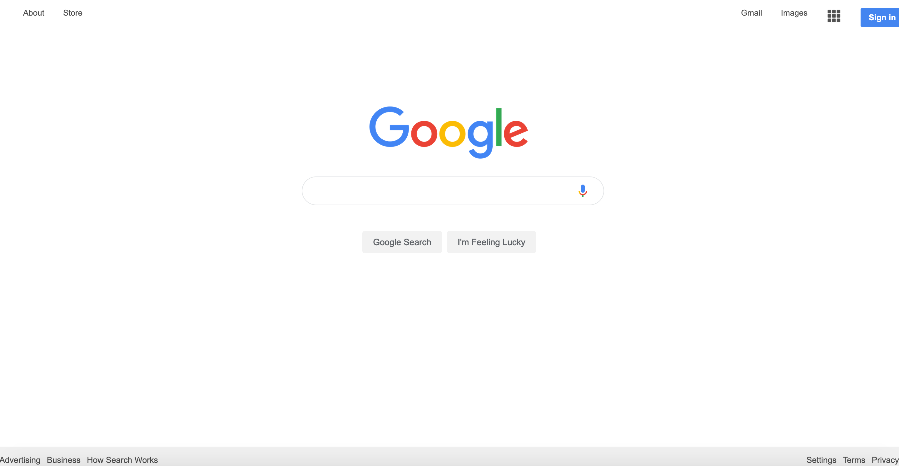

## My Google Clone submission for the Odin Project
##### Details:  http://www.theodinproject.com/courses/web-development-101/lessons/html-css

This is my interpretation of what Google's default page looks like. Each of the links bring you to the appropriate pages on Google's actual website. The exception is that the search and submit buttons are non-functional
